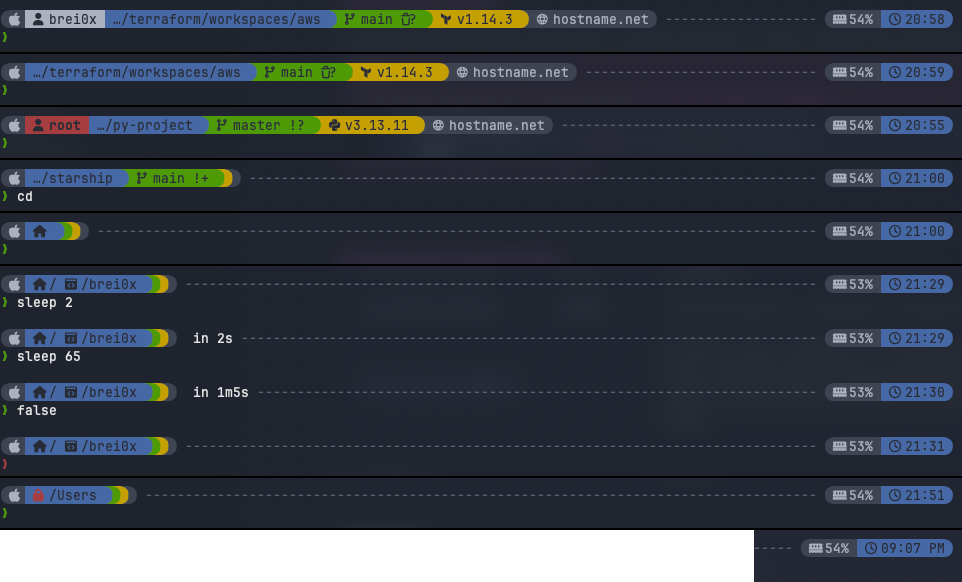
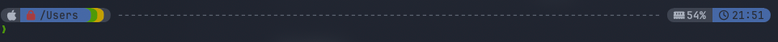
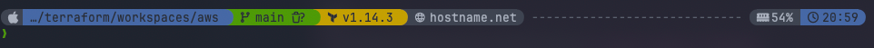
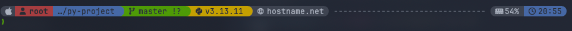
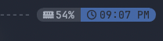
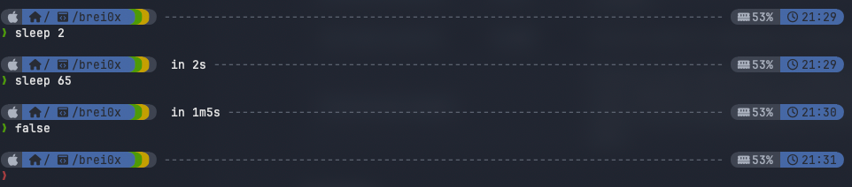

# Brei0x Starship Theme

A clean and professional Starship prompt theme inspired by Powerlevel10k, featuring a two-line layout with rich information and custom color palette.

## Preview



## Features

- **Two-line prompt** with powerline-style segments
- **OS detection** with custom icons for 40+ operating systems
- **Git integration** showing branch name and status (ahead/behind/diverged)
- **Multi-language support** for 20 programming languages and tools
- **System monitoring** with memory usage percentage
- **SSH hostname display** with dedicated icon
- **Command duration** tracking with desktop notifications
- **Vim mode indicators** for vi-style keybindings (normal, replace, visual modes)
- **Read-only directory indicator** with lock icon
- **Smart path truncation** with folder icon substitutions
- **Custom color palette** with professional, muted tones

## Installation

### Method 1: Direct download
```bash
# Using curl
curl -o ~/.config/starship.toml https://raw.githubusercontent.com/brei0x/starship/main/starship.toml

# Or using wget
wget -O ~/.config/starship.toml https://raw.githubusercontent.com/brei0x/starship/main/starship.toml
```

### Method 2: Git clone
```bash
# Clone the repository
git clone https://github.com/brei0x/starship.git

# Copy the configuration file
cp starship/starship.toml ~/.config/starship.toml
```

## Requirements

- [Starship](https://starship.rs/) installed and configured in your shell
- A [Nerd Font](https://www.nerdfonts.com/) installed and set as your terminal font (recommended: FiraCode Nerd Font, JetBrainsMono Nerd Font)
- Supported shells: Bash, Zsh, Fish, PowerShell

## Modules Included

### Left Side (Line 1)
| Module | Description |
|--------|-------------|
| **OS** | Detects and displays your operating system icon |
| **Username** | Shows current user (with red background for root) |
| **Directory** | Smart path truncation with read-only indicator |
| **Git Branch** | Current branch name with icon |
| **Git Status** | Shows ahead/behind/diverged status |
| **Languages** | C, Rust, Go, Node.js, PHP, Java, Kotlin, Haskell, Python, Ruby, C#/.NET, Swift, Scala, Dart, Lua, R, Perl, Elixir, Julia |
| **Terraform** | Version display |
| **Hostname** | SSH hostname with icon (SSH sessions only) |
| **Command Duration** | Execution time of long-running commands |

### Right Side (Line 1)
| Module | Description |
|--------|-------------|
| **Memory Usage** | RAM usage percentage |
| **Time** | Current time in HH:MM format |

### Line 2
| Module | Description |
|--------|-------------|
| **Character** | Prompt symbol with success/error colors and vim mode indicators |

## Directory Substitutions

The theme includes smart folder icon substitutions:

| Folder |
|--------|
| `~` (Home) |
| `Developer` |
| `Documents` |
| `Downloads` |
| `Music` |
| `Pictures` |

## Color Palette

The theme uses a custom `brei0x` palette with professional, muted colors:

| Color  | Hex       | Usage                                    |
|--------|-----------|------------------------------------------|
| Blue   | `#4668a6` | Directory, time, vim normal mode         |
| Green  | `#4E9A06` | Git branch/status, success prompt        |
| Yellow | `#C4A000` | Programming languages, vim replace/visual modes |
| Red    | `#A63D40` | Root user, read-only indicator, error prompt |
| Gray   | `#3e4451` | OS icon, hostname, memory usage          |
| Muted  | `#5c6370` | Fill separator                           |
| White  | `#abb2bf` | Text on gray backgrounds                 |
| Black  | `#282c34` | Text on colored backgrounds              |

## Customization

You can customize this theme by editing `~/.config/starship.toml`.

### Modify the color palette
```toml
[palettes.brei0x]
blue = "#4668a6"      # Navy blue
green = "#4E9A06"     # Tango green
yellow = "#C4A000"    # Tango gold
red = "#A63D40"       # Soft crimson
gray = "#3e4451"      # Dark gray
muted = "#5c6370"     # Muted gray
white = "#abb2bf"     # Off-white
black = "#282c34"     # Charcoal
```

### Add directory substitutions
```toml
[directory.substitutions]
"Projects" = " "
"Work" = " "
```

### Show username always (not just for root/SSH)
```toml
[username]
show_always = true
```

### Show hostname always (not just for SSH)
```toml
[hostname]
ssh_only = false
```

### Switch to 12-hour time format
```toml
[time]
time_format = "%I:%M %p"  # e.g., 09:07 PM
```

See the [Starship documentation](https://starship.rs/config/) for more options.

## Screenshots

### Basic prompt

*Minimal prompt showing OS icon, home directory, memory usage and time.*

### Git integration

*Git branch and status indicators (modified files, staged changes).*

### Read-only directory

*Lock icon indicates a read-only directory.*

### Full prompt with Terraform

*Complete prompt with username, git, Terraform version, and SSH hostname.*

### Without username

*Same context but with username hidden (default behavior for non-root users).*

### Root user with Python

*Root user highlighted in red, Python version and virtualenv support.*

### 12-hour time format

*Alternative time format configuration (12-hour with AM/PM).*

### Command duration + false/error prompt

*Command execution time displayed after long-running commands + false/error prompt.*

## License

This project is licensed under the [MIT License](LICENSE).

## Acknowledgments

Inspired by [Powerlevel10k](https://github.com/romkatv/powerlevel10k).