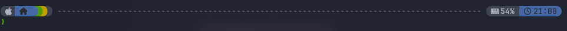
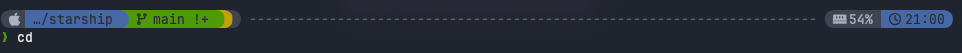
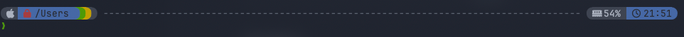
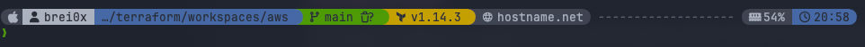
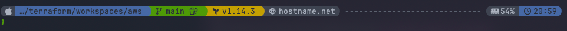
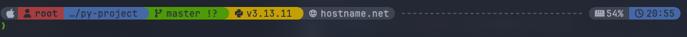
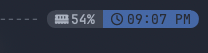
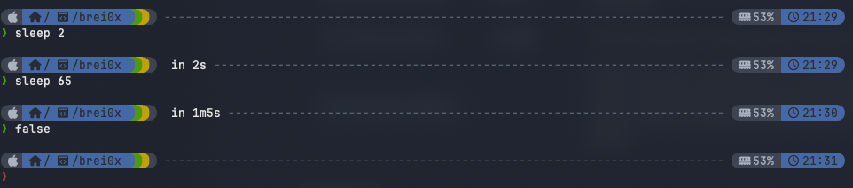

# Brei0x Starship Theme

A clean and professional Starship prompt theme inspired by Powerlevel10k, featuring a two-line layout with rich information and custom color palette.

## Preview

### Basic prompt

*Minimal prompt showing OS icon, home directory, memory usage and time.*

### Git integration

*Git branch and status indicators (modified files, staged changes).*

### Read-only directory

*Lock icon indicates a read-only directory.*

### Full prompt with Terraform

*Complete prompt with username, git, Terraform version, and SSH hostname.*

### Without username

*Same context but with username hidden (default behavior for non-root users).*

### Root user with Python

*Root user highlighted in red, Python version and virtualenv support.*

### 12-hour time format

*Alternative time format configuration (12-hour with AM/PM).*

### Command duration + false/error prompt

*Command execution time displayed after long-running commands + false/error prompt.*

## Features

- **Two-line prompt** with powerline-style segments
- **OS detection** with custom icons for 40+ operating systems
- **Git integration** showing branch name and status (ahead/behind/diverged)
- **Multi-language support** for 20+ programming languages and tools
- **System monitoring** with memory usage percentage
- **SSH hostname display** with dedicated icon
- **Command duration** tracking
- **Vim mode indicators** (normal, replace, visual)
- **Read-only directory indicator** with lock icon
- **Smart path truncation** with folder icon substitutions
- **Custom color palette** with professional, muted tones

## Installation

**Requirements**: [Starship](https://starship.rs/) and a [Nerd Font](https://www.nerdfonts.com/) (recommended: FiraCode Nerd Font or JetBrainsMono Nerd Font). See the [Installation wiki page](../../wiki/Installation) for full setup instructions.

```bash
curl -o ~/.config/starship.toml https://raw.githubusercontent.com/brei0x/starship/main/starship.toml
```

## Documentation

Full documentation is available in the [wiki](../../wiki):

| Page | Description |
|------|-------------|
| [Installation](../../wiki/Installation) | Installation methods and shell requirements |
| [Modules](../../wiki/Modules) | All prompt modules and directory substitutions |
| [Color Palette](../../wiki/Color-Palette) | Theme colors and hex values |
| [Customization](../../wiki/Customization) | How to personalize the theme |
| [Development](../../wiki/Development) | Validation, formatting, and contribution guide |

## License

This project is licensed under the [MIT License](LICENSE).

## Acknowledgments

Inspired by [Powerlevel10k](https://github.com/romkatv/powerlevel10k).
