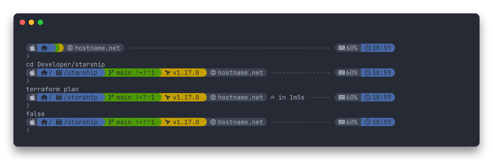
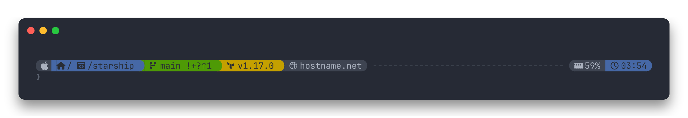
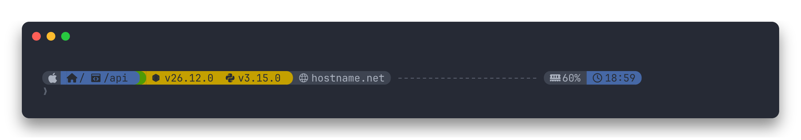
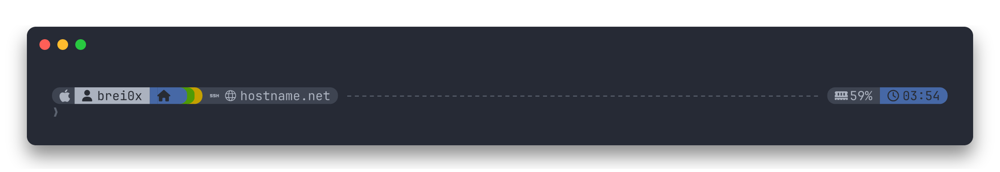
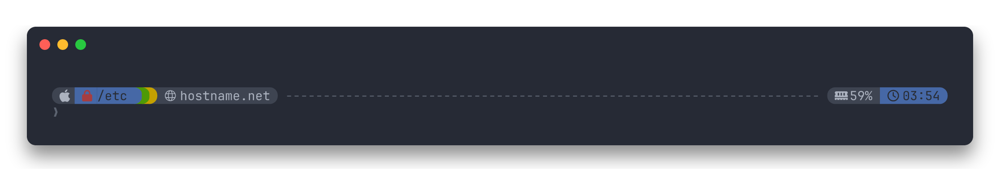
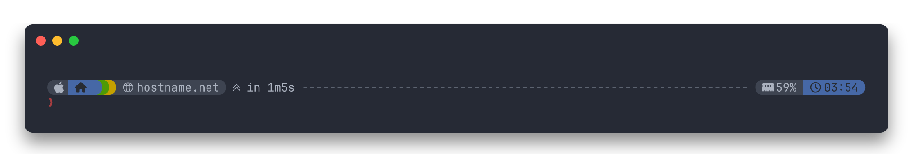
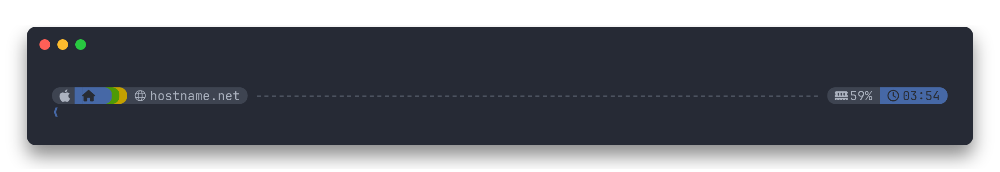

# Brei0x Starship Theme

A clean and professional Starship prompt theme inspired by Powerlevel10k, featuring a two-line layout with rich information and custom color palette.

## Preview



### Git repository

*Branch, then modified, staged and untracked files, one commit ahead, and the Terraform version.*

### Languages

*Node.js and Python detected from the project files.*

### SSH session

*The username appears over SSH (and for root), the hostname is always shown.*

### Read-only directory

*A lock marks a directory you cannot write to.*

### Command duration

*Execution time after a long-running command.*

### Vim normal mode

*The prompt character flips when the line editor is in normal mode.*

Regenerate these images with `sh scripts/screenshots.sh`, see the [Development](../../wiki/Development#screenshots) wiki page.

## Features

- **Two-line prompt** with powerline-style segments
- **OS detection** with custom icons for 40+ operating systems
- **Git integration** showing branch name and status (ahead/behind/diverged)
- **Multi-language support** for 20+ programming languages and tools
- **System monitoring** with memory usage percentage
- **SSH hostname display** with dedicated icon
- **Command duration** tracking
- **Vim mode indicators** (normal, replace, visual)
- **Read-only directory indicator** with lock icon
- **Smart path truncation** with folder icon substitutions
- **Custom color palette** with professional, muted tones

## Installation

**Requirements**: [Starship](https://starship.rs/) and a [Nerd Font](https://www.nerdfonts.com/) (recommended: FiraCode Nerd Font or JetBrainsMono Nerd Font). See the [Installation wiki page](../../wiki/Installation) for full setup instructions.

```bash
curl -o ~/.config/starship.toml https://raw.githubusercontent.com/brei0x/starship/main/starship.toml
```

## Documentation

Full documentation is available in the [wiki](../../wiki):

| Page | Description |
|------|-------------|
| [Installation](../../wiki/Installation) | Installation methods and shell requirements |
| [Modules](../../wiki/Modules) | All prompt modules and directory substitutions |
| [Color Palette](../../wiki/Color-Palette) | Theme colors and hex values |
| [Customization](../../wiki/Customization) | How to personalize the theme |
| [Development](../../wiki/Development) | Local checks, screenshots, releases and contribution guide |

## License

This project is licensed under the [MIT License](LICENSE).

## Acknowledgments

Inspired by [Powerlevel10k](https://github.com/romkatv/powerlevel10k).
